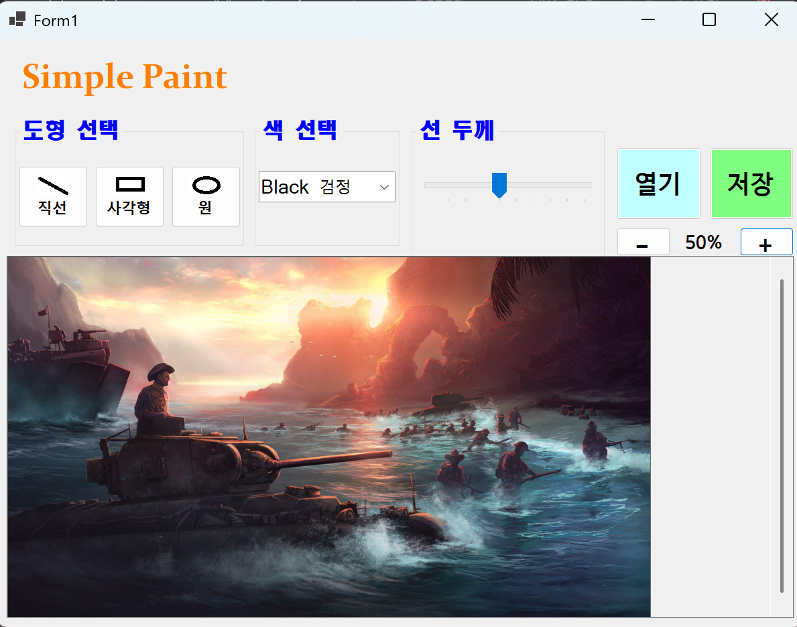

# (C# 코딩) OOOOO

## 개요
- C# 프로그래밍 학습
- 1줄 소개: 직선, 사각형, 원을 그리는 그림판 프로그램
- 사용한 플랫폼:
	- C#, .NET Windows Forms, Visual Studio, GitHub
- 사용한 컨트롤:
	- Label, Button, ComboBox, TrackBar, PictureBox, Panel
- 사용한 기술과 구현한 기능:
	- Visual Studio를 이용하여 Windows Forms 기반 UI를 디자인
	- Button을 이용하여 직선, 사각형, 원 도형 선택 기능 구현
	- ComboBox를 이용하여 검정, 빨강, 파랑, 초록 색상 선택 기능 구현
	- TrackBar를 이용하여 선 굵기를 단계별로 조절하는 기능 구현
	- PictureBox와 Bitmap을 이용하여 실제 그림이 저장되는 캔버스 구성
	- 마우스 드래그 이벤트를 이용하여 도형을 그리고, 저장과 외부 이미지 불러오기 기능까지 확장

## 실행 화면 (과제1)
- 코드의 실행 스크린샷과 구현 내용 설명

- 구현한 내용 (위 그림 참조)
  - UI 구성 : 앱 이름을 표시하는 Label, 도형 선택 GroupBox, 색 선택 GroupBox, 선 두께 GroupBox, 열기/저장 Button, 그림을 표시하는 PictureBox를 배치하여 그림판 화면을 구성
  - 도형 선택 : btnLine, btnRectangle, btnCircle 버튼 3개를 이용해서 사용자가 직선, 사각형, 원 중 원하는 도형을 선택할 수 있도록 구성
  - 색 선택 : cmbColor ComboBox를 이용해서 검은색, 빨간색, 파란색, 초록색 중 하나를 선택할 수 있도록 구성
  - 선 굵기 선택 : trbLineWidth TrackBar를 이용해서 선 굵기를 1~10단계로 조절할 수 있도록 구성
  - 캔버스 구성 : picCanvas PictureBox를 이용하여 사용자가 실제로 그림을 그릴 수 있는 흰색 캔버스 영역을 배치
  - 컨트롤 이름 지정 : lblAppName, gbxShape, gbxColor, gbxLineWidth, btnOpenFile, btnSaveFile처럼 기능을 알 수 있는 이름으로 지정하여 코드 가독성을 높임
  - 화면 배치 : 도형 선택, 색 선택, 선 두께 선택 영역을 상단에 모으고, 아래쪽에는 넓은 캔버스를 배치하여 그림판처럼 사용할 수 있도록 구성

 

## 실행 화면 (과제2)
- 코드의 실행 스크린샷과 구현 내용 설명

- 구현한 내용 (위 그림 참조)
  - 마우스 드래그 기능 : PictureBox로 만든 캔버스 위에서 마우스를 누른 위치를 시작점으로 저장하고, 마우스를 움직인 뒤 손을 떼는 위치를 끝점으로 저장하도록 구현
  - 도형 그리기 : 선택된 도형 모드에 따라 직선, 사각형, 원을 캔버스 위에 그릴 수 있도록 구현
  - 미리보기 기능 : 마우스를 드래그하는 동안 현재 위치까지의 도형을 점선으로 미리 보여주도록 구현
  - 도형 확정 : 마우스 버튼을 놓는 순간 선택한 도형이 실제 Bitmap 캔버스에 그려지도록 구현
  - 화면 갱신 : PictureBox의 Invalidate()를 사용하여 드래그 중 미리보기와 그리기 결과가 화면에 바로 반영되도록 구성
  - 선 색상과 굵기 적용 : 과제1에서 선택한 ComboBox의 색상과 TrackBar의 선 굵기 값이 실제 도형 그리기에 적용되도록 구현

## 실행 화면 (과제3)
- 코드의 실행 스크린샷과 구현 내용 설명

- 구현한 내용 (위 그림 참조)
  - 그림 저장 기능 : 저장 버튼을 누르면 SaveFileDialog가 열리도록 구현
  - 저장 형식 선택 : PNG, JPG, BMP 형식 중 하나를 선택해서 저장할 수 있도록 구현
  - 캔버스 저장 : PictureBox 화면이 아니라 실제 그림이 저장된 Bitmap 캔버스를 이미지 파일로 저장하도록 구현
  - 파일 이름 지정 : 사용자가 원하는 위치와 파일 이름을 직접 지정해서 저장할 수 있도록 구성
  - 저장 포맷 처리 : SaveFileDialog에서 선택한 필터 번호를 확인하여 PNG는 ImageFormat.Png, JPG는 ImageFormat.Jpeg, BMP는 ImageFormat.Bmp로 저장되도록 구현
  - 그리기 결과 보존 : 마우스로 그린 선, 사각형, 원이 canvasBitmap에 확정된 뒤 저장되므로 화면에 보이는 최종 그림과 저장되는 파일의 내용이 일치하도록 구성
  - 사용성 개선 : 기본 파일 이름을 simplepaint로 지정하여 저장 창이 열렸을 때 사용자가 바로 파일 이름을 수정하거나 원하는 폴더를 선택할 수 있도록 구현

## 실행 화면 (과제4)
- 코드의 실행 스크린샷과 구현 내용 설명

- 구현한 내용 (위 그림 참조)
  - 외부 이미지 열기 : 열기 버튼을 누르면 OpenFileDialog가 열리고 PNG, JPG, BMP, GIF 이미지 파일을 불러올 수 있도록 구현
  - 이미지 캔버스 적용 : 불러온 이미지를 canvasBitmap으로 사용하여 이미지 위에 직선, 사각형, 원을 그릴 수 있도록 구현
  - 캔버스 크기 조정 : 불러온 이미지 크기에 맞게 PictureBox 크기가 자동으로 조정되도록 구현
  - 스크롤 기능 : Panel의 AutoScroll 기능을 사용하여 이미지가 큰 경우 스크롤바로 이동할 수 있도록 구성
  - 확대/축소 기능 : +, - 버튼으로 캔버스를 확대하거나 축소하고 현재 배율을 표시하도록 구현
  - 좌표 보정 : 확대/축소 상태에서도 마우스 위치가 실제 이미지 좌표에 맞게 변환되도록 구현
  - 수정 이미지 저장 : 외부 이미지 위에 그린 결과도 과제3의 저장 기능을 이용해 PNG, JPG, BMP 파일로 저장할 수 있도록 구현
