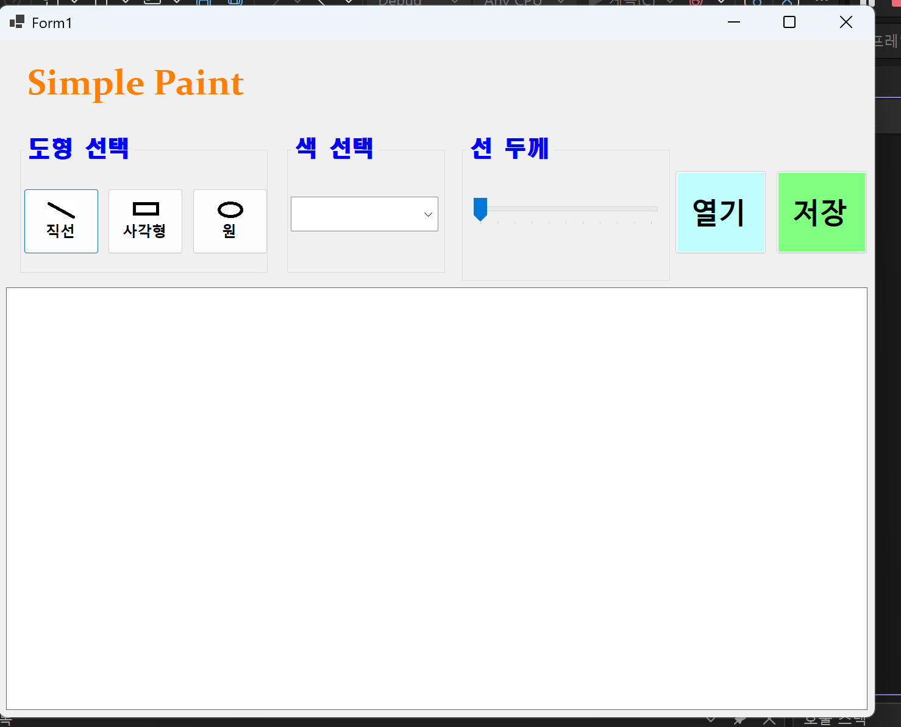
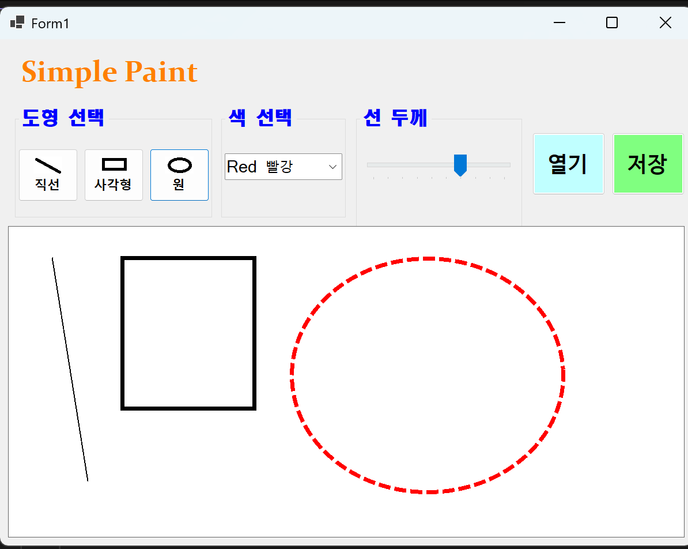
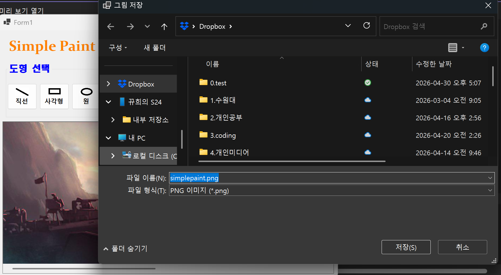
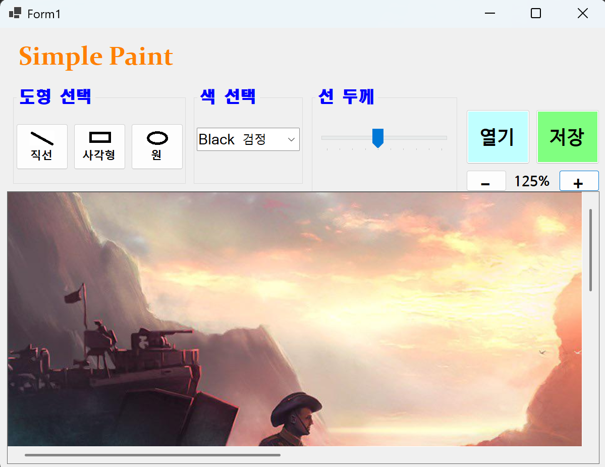

# (C# 코딩) OOOOO

## 개요
- C# 프로그래밍 학습
- 1줄 소개: 직선, 사각형, 원을 그리는 그림판 프로그램
- 사용한 플랫폼:
	- C#, .NET Windows Forms, Visual Studio, GitHub
- 사용한 컨트롤:
	- Label, TextBox, ListBox, Button, ComboBox, Panel
- 사용한 기술과 구현한 기능:
	- visual studio를 이용하여 ui 디자인

## 실행 화면 (과제1)
- 코드의 실행 스크린샷과 구현 내용 설명

- 구현한 내용 (위 그림 참조)
  - UI 구성 : 도형 선택, 색 선택, 굻기 선택 , 캔버스 구성
  - 도형선택 : 버튼 3개를 이용해서 직선, 사각형, 원 선택. 
  - 색 선택 : ComboBox를 이용해서 검은색, 빨간색, 파란색, 초록색 선택
  - 선 굵기 선택: TrackBar 이용해서 선 굵기를 1~10단계로 선택
  - 캔버스 : PictureBox를 이용해서 캔버스 구성.

 

## 실행 화면 (과제2)
- 코드의 실행 스크린샷과 구현 내용 설명

- 구현한 내용 (위 그림 참조)
  - 마우스 드래그 기능 : PictureBox로 만든 캔버스 위에서 마우스를 누른 위치를 시작점으로 저장하고, 마우스를 움직인 뒤 손을 떼는 위치를 끝점으로 저장하도록 구현
  - 도형 그리기 : 선택된 도형 모드에 따라 직선, 사각형, 원을 캔버스 위에 그릴 수 있도록 구현
  - 미리보기 기능 : 마우스를 드래그하는 동안 현재 위치까지의 도형을 점선으로 미리 보여주도록 구현
  - 도형 확정 : 마우스 버튼을 놓는 순간 선택한 도형이 실제 Bitmap 캔버스에 그려지도록 구현
  - 화면 갱신 : PictureBox의 Invalidate()를 사용하여 드래그 중 미리보기와 그리기 결과가 화면에 바로 반영되도록 구성
  - 선 색상과 굵기 적용 : 과제1에서 선택한 ComboBox의 색상과 TrackBar의 선 굵기 값이 실제 도형 그리기에 적용되도록 구현

## 실행 화면 (과제3)
- 코드의 실행 스크린샷과 구현 내용 설명

- 구현한 내용 (위 그림 참조)
  - OOOOO

## 실행 화면 (과제4)
- 코드의 실행 스크린샷과 구현 내용 설명

- 구현한 내용 (위 그림 참조)
  - OOOOO
